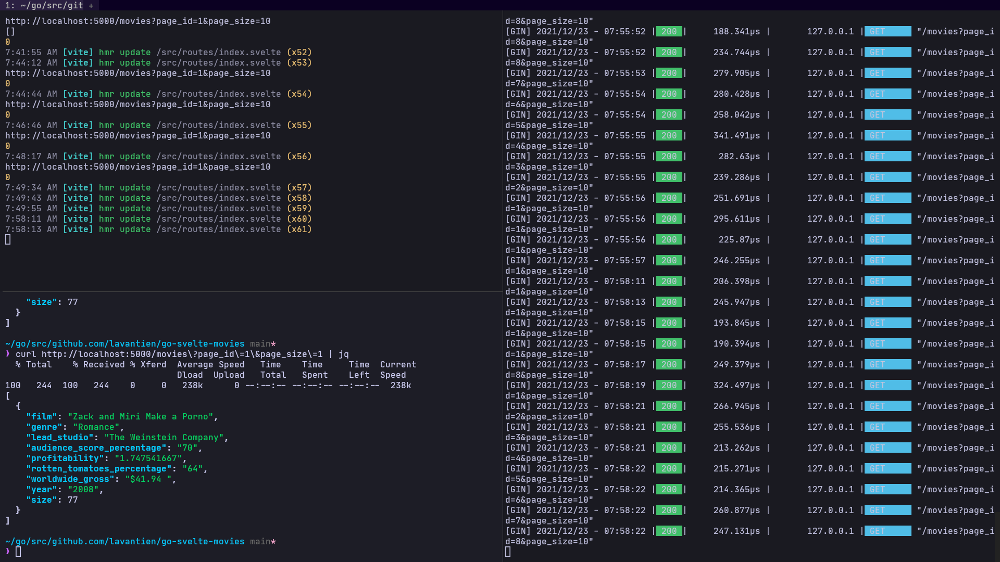
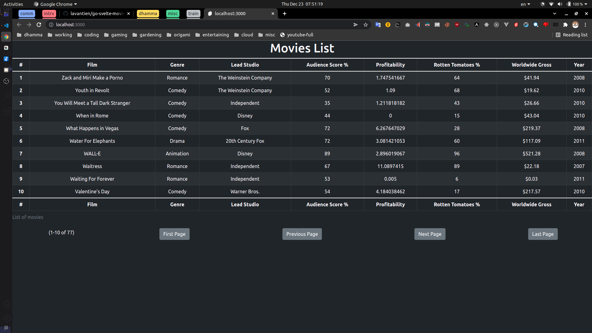

# go-svelte-movies

Go API that read a csv file and provide endpoints for Svelte UI to fetch movies from

## Requirements

1. [X] Go API that fetch data from a csv file and provide endpoints for get a list of movies
2. [X] Svelte UI with a paginated table of movies (10 movies/page)

- **Endpoints**:

<details>
	<summary>See details</summary>

### Rqm1: Go API that fetch data from a csv file and provide endpoints for get a list of movies

```bash
# See Booting Up running instructions in the section below first, and then:


curl 'http://localhost:5000/movies?page_id=1&page_size=10' | jq
# Should return
[
  {
    "Film": "Film",
    "Genre": "Genre",
    "LeadStudio": "Lead Studio",
    "AudienceScorePercentage": "Audience score %",
    "Profitability": "Profitability",
    "RottenTomatoesPercentage": "Rotten Tomatoes %",
    "WorldwideGross": "Worldwide Gross",
    "Year": "Year"
  },
  {
    "Film": "Zack and Miri Make a Porno",
    "Genre": "Romance",
    "LeadStudio": "The Weinstein Company",
    "AudienceScorePercentage": "70",
    "Profitability": "1.747541667",
    "RottenTomatoesPercentage": "64",
    "WorldwideGross": "$41.94 ",
    "Year": "2008"
  },
  {
    "Film": "Youth in Revolt",
    "Genre": "Comedy",
    "LeadStudio": "The Weinstein Company",
    "AudienceScorePercentage": "52",
    "Profitability": "1.09",
    "RottenTomatoesPercentage": "68",
    "WorldwideGross": "$19.62 ",
    "Year": "2010"
  },
  {
    "Film": "You Will Meet a Tall Dark Stranger",
    "Genre": "Comedy",
    "LeadStudio": "Independent",
    "AudienceScorePercentage": "35",
    "Profitability": "1.211818182",
    "RottenTomatoesPercentage": "43",
    "WorldwideGross": "$26.66 ",
    "Year": "2010"
  },
  {
    "Film": "When in Rome",
    "Genre": "Comedy",
    "LeadStudio": "Disney",
    "AudienceScorePercentage": "44",
    "Profitability": "0",
    "RottenTomatoesPercentage": "15",
    "WorldwideGross": "$43.04 ",
    "Year": "2010"
  },
  {
    "Film": "What Happens in Vegas",
    "Genre": "Comedy",
    "LeadStudio": "Fox",
    "AudienceScorePercentage": "72",
    "Profitability": "6.267647029",
    "RottenTomatoesPercentage": "28",
    "WorldwideGross": "$219.37 ",
    "Year": "2008"
  },
  {
    "Film": "Water For Elephants",
    "Genre": "Drama",
    "LeadStudio": "20th Century Fox",
    "AudienceScorePercentage": "72",
    "Profitability": "3.081421053",
    "RottenTomatoesPercentage": "60",
    "WorldwideGross": "$117.09 ",
    "Year": "2011"
  },
  {
    "Film": "WALL-E",
    "Genre": "Animation",
    "LeadStudio": "Disney",
    "AudienceScorePercentage": "89",
    "Profitability": "2.896019067",
    "RottenTomatoesPercentage": "96",
    "WorldwideGross": "$521.28 ",
    "Year": "2008"
  },
  {
    "Film": "Waitress",
    "Genre": "Romance",
    "LeadStudio": "Independent",
    "AudienceScorePercentage": "67",
    "Profitability": "11.0897415",
    "RottenTomatoesPercentage": "89",
    "WorldwideGross": "$22.18 ",
    "Year": "2007"
  },
  {
    "Film": "Waiting For Forever",
    "Genre": "Romance",
    "LeadStudio": "Independent",
    "AudienceScorePercentage": "53",
    "Profitability": "0.005",
    "RottenTomatoesPercentage": "6",
    "WorldwideGross": "$0.03 ",
    "Year": "2011"
  }
]

curl 'http://localhost:5000/movies?page_id=2&page_size=2' | jq
# Should return
[
  {
    "Film": "Valentine's Day",
    "Genre": "Comedy",
    "LeadStudio": "Warner Bros.",
    "AudienceScorePercentage": "54",
    "Profitability": "4.184038462",
    "RottenTomatoesPercentage": "17",
    "WorldwideGross": "$217.57 ",
    "Year": "2010"
  },
  {
    "Film": "Tyler Perry's Why Did I get Married",
    "Genre": "Romance",
    "LeadStudio": "Independent",
    "AudienceScorePercentage": "47",
    "Profitability": "3.7241924",
    "RottenTomatoesPercentage": "46",
    "WorldwideGross": "$55.86 ",
    "Year": "2007"
  }
]
```

### Rqm2: Svelte UI with a paginated table of movies (10 movies/page)




</details>

## Technology Stack

- **Go 1.17**: *Leverage the standard libraries as much as possible*
- **Node/Svelte+Bootstrap**: *Node is just for install Svelte, Svelte is an revolutionize framework, and Bootstrap is just great*

## Philosophy and Architecture

- **Adaptive Minimalism**: *I always keep it as simple as possible, but with a highly decoupled structure we ensure high adaptivity and extensibility, on top of that minimal solid head start. Things are implement only when they're absolutely needed*

## Booting Up

- Install the dependencies:

```bash
make install
```

- Run server and webui:

```bash
make server

make webui
```

## Development Infrastructure Setup

### Toolings Installation Guide

- [**Golang**](https://go.dev/doc/install):

```bash
# Go to go.dev/dl and download a binary, in this example it's version 1.17.5

sudo rm -rf /usr/local/go && sudo tar -C /usr/local -xzf go1.17.5.linux-amd64.tar.gz

# Add these below to your .bashrc or .zshrc
export GOPATH=/home/<username>/go
export GOBIN=/home/<username>/go/bin
export PATH=$PATH:/usr/local/go/bin
export PATH=$PATH:$GOBIN
```

- [**CURL**](https://curl.se/download.html) + [**JQ**](https://stedolan.github.io/jq/) + [**Chocolatery**](https://docs.chocolatey.org/en-us/choco/setup) + [**Make**](https://community.chocolatey.org/packages/make):

```bash
sudo apt install curl jq

# These tools are needed only for Windows users

# Run this in an Admin cmd to install Chocolatery first
@"%SystemRoot%\System32\WindowsPowerShell\v1.0\powershell.exe" -NoProfile -InputFormat None -ExecutionPolicy Bypass -Command "[System.Net.ServicePointManager]::SecurityProtocol = 3072; iex ((New-Object System.Net.WebClient).DownloadString('https://community.chocolatey.org/install.ps1'))" && SET "PATH=%PATH%;%ALLUSERSPROFILE%\chocolatey\bin"

# Then install GNU-Make, cURL, and jq via Chocolatery in Admin pwsh
choco install make curl jq
```

- [**Node**](https://nodejs.org/en/download/):

```bash
# Download the binary and install, or better, install node via nvm: https://github.com/nvm-sh/nvm
```
